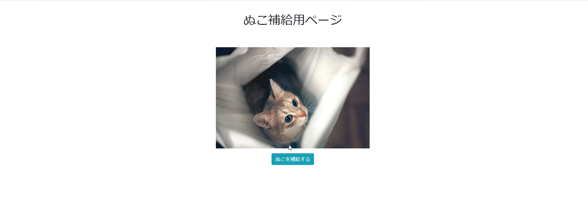

# ぬこ補給アプリ(nuko supply app)
[](https://github.com/MakeNowJust/sushi-ware)
## Overview
手軽にぬこ画像を補給できるReact製Webアプリ  

## Description
補給ボタンを押すだけで、かわいいぬこ画像を得ることができる  
普段モバイルアプリばかりいじっているのもあり、なんとなくReact触ってみたくなって作ってみた最初に作品   

## Getting Started
1. [theCatApi.com](https://thecatapi.com)にて、トークンを生成する
2. ```package.json``` と同じ階層に```.env```を作成
3. 内部に```REACT_APP_URL="https://api.thecatapi.com/v1/images/search?api_key=YOUR_API_KEY```と記述(YOUR_API_KEYのところにメールで届いたトークンをコピペ)
4. ```npm start```でサーバーを建てる

## Demo


## このアプリのライセンス
sushi-ware license


