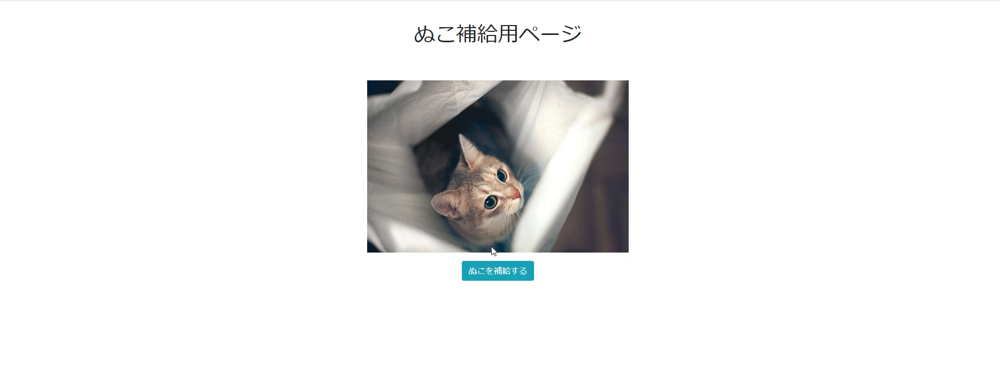

# ぬこ補給アプリ(nuko supply app)
## Overview
手軽にぬこ画像を補給できるReact製Webアプリ  

## Description
補給ボタンを押すだけで、かわいいぬこ画像を得ることができる  
なんかReact触ってみたくなって作ってみた最初に作品   

## Getting Start
1. [theCatApi.com](https://thecatapi.com)にて、トークンを生成する
2. ```package.json``` と同じ階層に```.env```を作成
3. 内部に```REACT_APP_URL="https://api.thecatapi.com/v1/images/search?api_key=YOUR_API_KEY```と記述(YOUR_API_KEYのところにメールで届いたトークンをコピペ)
4. ```npm start```でサーバーを建てる

## Demo


## このアプリのライセンス
MIT Lisence

## 使用ライブラリのライセンスについて

### BootStrap
### axios
### React
The MIT License (MIT)

Copyright (c) 2011-2018 Twitter, Inc.
Copyright (c) 2011-2018 The Bootstrap Authors
Copyright (c) 2014-present Matt Zabriskie
Copyright (c) Facebook, Inc. and its affiliates.

Permission is hereby granted, free of charge, to any person obtaining a copy
of this software and associated documentation files (the "Software"), to deal
in the Software without restriction, including without limitation the rights
to use, copy, modify, merge, publish, distribute, sublicense, and/or sell
copies of the Software, and to permit persons to whom the Software is
furnished to do so, subject to the following conditions:

The above copyright notice and this permission notice shall be included in
all copies or substantial portions of the Software.

THE SOFTWARE IS PROVIDED "AS IS", WITHOUT WARRANTY OF ANY KIND, EXPRESS OR
IMPLIED, INCLUDING BUT NOT LIMITED TO THE WARRANTIES OF MERCHANTABILITY,
FITNESS FOR A PARTICULAR PURPOSE AND NONINFRINGEMENT. IN NO EVENT SHALL THE
AUTHORS OR COPYRIGHT HOLDERS BE LIABLE FOR ANY CLAIM, DAMAGES OR OTHER
LIABILITY, WHETHER IN AN ACTION OF CONTRACT, TORT OR OTHERWISE, ARISING FROM,
OUT OF OR IN CONNECTION WITH THE SOFTWARE OR THE USE OR OTHER DEALINGS IN
THE SOFTWARE.


